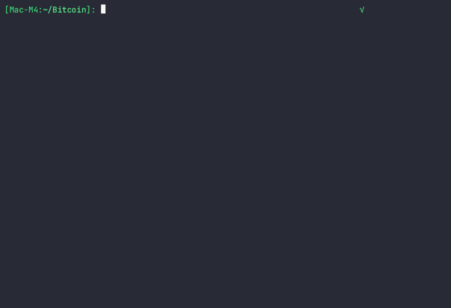
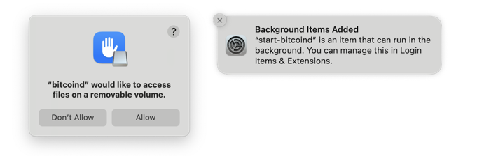
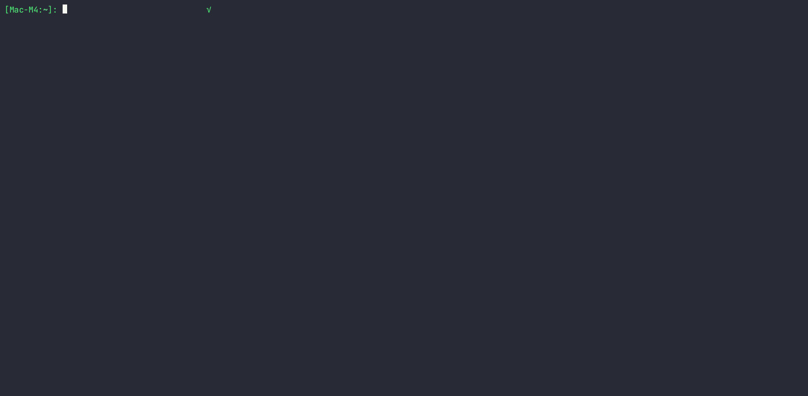
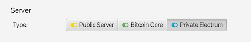
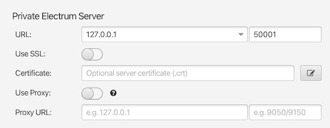
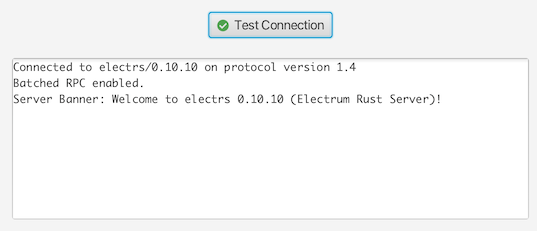

[](#)
[](https://bitcoincore.org/en/releases/)
[](https://github.com/romanz/electrs?tab=readme-ov-file#readme)

# Bitcoin Mac Node Builder



## Overview

Automated, configurable installer and dashboard for running a self-hosted [Bitcoin Core full node](https://github.com/bitcoin/bitcoin) and optional [Electrs](https://github.com/romanz/electrs) (Electrum server) on macOS. Running a full node with Electrs allows you to directly connect popular wallets, including [Electrum](https://electrum.org) and [Sparrow Wallet](https://www.sparrowwallet.com). This give you the privacy and financial self-sovereignty to check wallet balances and send transactions without trusting third party servers.

Bitcoin Mac Node builder supports:
* Building Bitcoin Core and Electrs from GitHub source (or by downloading verified binaries)
* Concise installer progress updates with detailed popup views and logging for troubleshooting
* Multiple Bitcoin Core versions (29.x, 30.x, master branch) with fast version switching
* Generating Bitcoin Core and Electrs config files (`bitcoin.conf`, `config.toml`) from simple, well-documented meta settings file ([global_config.yaml](./global_config.yaml))
* Real-time monitoring with the included terminal node monitor dashboard (`node-monitor.sh`)

For maintainability and transparency, all the scripts are written in zsh (the default shell on macOS).

## Built for macOS
While other Bitcoin Core node builders exist, Bitcoin Mac Node Builder is specifically designed to make installation and configuration of Bitcoin Core and Electrs on macOS both robust and easy-to-maintain:

- Complete installation and configuration process from A to Z:
    - Downloading from GitHub (using tag or branch identifer to specify version)
    - Installation of all dependencies
    - Installation and configuration of Tor (optional)
    - Building from source (or optional use of verified binary downloads)
    - Running unit tests (optional)
    - Generation of config files
    - Generation and installation of macOS launch agents
    - Terminal node monitor dashboard with adaptive layout of status and logs
- Installed macOS launch agents and launch helper scripts:
    - Start Bitcoin Core and Electrs daemons on macOS user login 
    - Start daemons when target SSD volumes mount (useful for MacBooks with external SSDs)
    - Delay Electrs startup until after Bitcoin Core is running
    - Automatically relaunch daemons after any unexpected shutdowns

Once the Bitcoin initial block download has completed, your macOS node will run quietly in the background using negligable CPU resources. Running a MacBook that isn't always connected to your node's external SSD? Bitcoin Mac Node Builder will automatically detect the external SSD when it is connected and quickly catch-up your node to the lastest block.

### Simplified Configuration
Configuring Bitcoin Core's `bitcoin.conf` file can be a complex process. Its configuration options have evolved over more than a decade and the interactions between some options can be unintuitive. Bitcoin Mac Node Builder automates the process by generating the config files (Bitcoin Core's `bitcoin.conf` and Electrs's `config.toml`) from a simpler, well-documented meta settings file: [global_config.yaml](./global_config.yaml). This simplified settings file provides the configuration options most often needed for a self-hosted Bitcoin node, while also allowing for raw config options to be passed through during config file generation.

### Seamless Tor and Electrs Integration
The simplified [global_config.yaml](./global_config.yaml) meta settings file is also used to automatically configure Tor for privacy (if enabled) and ensure Electrs compatibility. No more guessing how to configure Bitcoin and Electrs to work together – just enable Electrs in the meta settings file and Bitcoin Mac Node Builder will do the rest.

## Requirements

- macOS with Xcode Command Line Tools (auto-installed if missing)
- Sufficient storage (blockchain + indexes can be large; 1 TB recommended)
- External SSD strongly recommended for performance

## Installing and Usage

1. Quit the Bitcoin GUI app or stop the `bitcoind` daemon if either is running.
2. Git clone the repo and edit `global_config.yaml` to specify your install destination paths (`target_path`).
   ```zsh
   git clone https://github.com/pricklypierre/bitcoin-mac-node-builder
   cd bitcoin-mac-node-builder
   open global_config.yaml
   ```

   
   
   The blockchain and indexes need slightly less than 1 TB of storage, so an external SSD is recommended. You can make other configuration changes in `global_config.yaml`, but the defaults are configured to work well for most users and the installer scripts can be re-run if changes are later needed.
3. Execute the Bitcoin Core installer script:
   ```zsh
   ./bitcoin-core-install.sh
   ```
   If Xcode Command Line Tools are missing, the installer will prompt you to install them and re-run the installer script. When the Bitcoin Core daemon starts, macOS may prompt to allow access to the external drive and you will be notified of the `start-bitcoind` background item being added.

   
4. Optionally execute the Electrs Electrum Server installer script:
   ```zsh
   ./electrs-install.sh
   ```
   When the Electrs daemon starts, macOS will show similar notifications as with Bitcoin Core.
5. The initial block download (IBD) can take a long time (possibly days), depending on your ISP speed and SSD performance. Note the Electrs daemon will wait until after the IBD is complete to start its indexing (which takes several hours). To monitor both services start the node monitor dashboard:
   ```zsh
   ./node-monitor.sh
   ```
   The node monitor has an adaptive layout, so resizing the Terminal window will show more information, including live logs for troubleshooting:
   
   The daemons are started automatically by the installers. For manually stopping/starting the daemons from the dashboard press:<br>&nbsp;&nbsp;&nbsp;&nbsp;`B` (Bitcoin)&nbsp;&nbsp;&nbsp;&nbsp;`E` (Electrs)&nbsp;&nbsp;&nbsp;&nbsp;`Q` (quit the dashboard)

## Connecting Electrum Wallet to Electrs

After Bitcoin Core + Electrs are installed and the initial block download (and Electrs indexing) is complete, you can connect your [Electrum Wallet](https://electrum.org) directly to your node.

1. Use the node monitor dashboard (`node-monitor.sh`) to monitor Bitcoin Core and Electrs. Wait for Bitcoin Core to complete the initial block download, and wait for Electrs to finish indexing.
2. Quit the Electrum Wallet app if it is running, or use `electrum stop` from the Terminal if the daemon is running.
3. Modify the Electrum Wallet configuration so that it only connects to your local Electrs server:
   ```zsh
   ELECTRS_IP="127.0.0.1"
   electrum daemon &; sleep 3
   electrum setconfig auto_connect false
   electrum setconfig oneserver true
   electrum setconfig server ${ELECTRS_IP}:50001:t
   electrum stop
   ```
   If your Electrum wallet is on a different Mac than your node, then change change `ELECTRS_IP="127.0.0.1"` to your local Electrs server IP address.
4. Relaunch the Electrum Wallet app.
5. Verify that Electrum is connected to your local Electrs server via:
   ```zsh
   electrum getinfo | jq -r '.connected, .spv_nodes, .server'
   ```
   which should return something like this:
   ```
   true
   1
   127.0.0.1
   ```
   indicating that it is connected (`true`) to one server (`1`) that matches the local Electrs server IP address (`127.0.0.1`) you specified by `ELECTRS_IP`.
6. Bask in the joy of financial self-sovereignty.

## Connecting Sparrow Wallet to Electrs

You can also connect your [Sparrow Wallet](https://www.sparrowwallet.com) directly to your node. By using Bitcoin Core + Electrs, you can enable "[Expert Stage](https://sparrowwallet.com/docs/best-practices.html#the-expert-stage)" mode in Sparrow, which allows you to directly use Electrs when managing wallets and sending transactions.

1. Use the node monitor dashboard (`node-monitor.sh`) to monitor Bitcoin Core and Electrs. Wait for Bitcoin Core to complete the initial block download, and wait for Electrs to finish indexing.
2. Choose the `Sparrow->Setting` menu and under the `Server` panel choose the `Private Electrum` type option:

   
3. Use the settings:

   
   - URL: `127.0.0.1` or your local Electrs server IP address
   - Port: `50001`
   - Use SSL: `Off / Disabled`
4. Press the `Test Connection` button.

   
5. Bask in the joy of financial self-sovereignty.

## Using with an Existing Bitcoin Core Installation

Although the Bitcoin Mac Node Builder is designed to install and configure Bitcoin Core from scratch, it can also be used with an existing Bitcoin Core installation to avoid having to re-download and verify all the blocks. Note that the `bitcoin-core-install.sh` script creates an an alias (symlink) here:

&nbsp;&nbsp;&nbsp;`~(user folder)/Library/Application Support/Bitcoin`

to the Bitcoin Core `target_path` specified in the `global_config.yaml` so that Bitcoin Core commands find the config file and data directories. If you have a previous Bitcoin Core installation that has installed directly to that default location, then `bitcoin-core-install.sh` will fail to install since it cannot safely create the symlink.

If you have a previous Bitcoin Core installation then:

1. Rename or move the folder (if it exists):

   `~(user folder)/Library/Application Support/Bitcoin`
2. Execute the Bitcoin Core installer script (see detailed steps above):
   ```zsh
   cd bitcoin-mac-node-builder
   ./bitcoin-core-install.sh
   ```
3. Execute the installed `stop.sh` script to stop the Bitcoin Core daemon.
4. Copy from the previous installation into the new installation (specified by `target_path` in the `global_config.yaml`) the following directories and files:
   - `blocks/`
   - `chainstate/`
   - `indexes/`
   - `anchors.dat`
   - `peers.dat`
   - `banlist.json`
5. Bitcoin Mac Node Builder automatically generates the `bitcoin.conf` to ensure Electrs (and optionally Tor) compatibility, so it is recommended to use it if possible. If you have a custom `bitcoin.conf` file then you can copy it into the new installation, but note you will need to set `generate_config_file` to `false` in the `global_config.yaml` file, so subsequent runs of the installer will not overwrite your custom `bitcoin.conf` file.
6. Execute the installed `start.sh` script to re-start the Bitcoin Core daemon.
7. Monitor the Bitcoin Core startup using the node monitor dashboard:
   ```zsh
   cd bitcoin-mac-node-builder
   ./node-monitor.sh
   ```

## Installer Script Options

Options for `bitcoin-core-install.sh`:
```
-c   Clean install. Forces fresh download and complete rebuild.
-f   Fast install only source and config changes. Skips dependency and startup checks.
     A complete build must be done initially to install dependencies.
-u   Uninstall Bitcoin Core but leaves data directories: blocks, chainstate, indexes.
-uu  Uninstall Bitcoin Core including all data directories.
```

Options for `electrs-install.sh`:
```
-c   Clean install. Forces fresh download and complete rebuild.
-f   Fast install only source and config changes. Skips dependency and startup checks.
     A complete build must be done initially to install dependencies.
-u   Uninstall Electrs Electrum Server but leaves 'db' data directory.
-uu  Uninstall Electrs Electrum Server including all data directories.
```

## License

MIT License. See LICENSE.txt for details.
